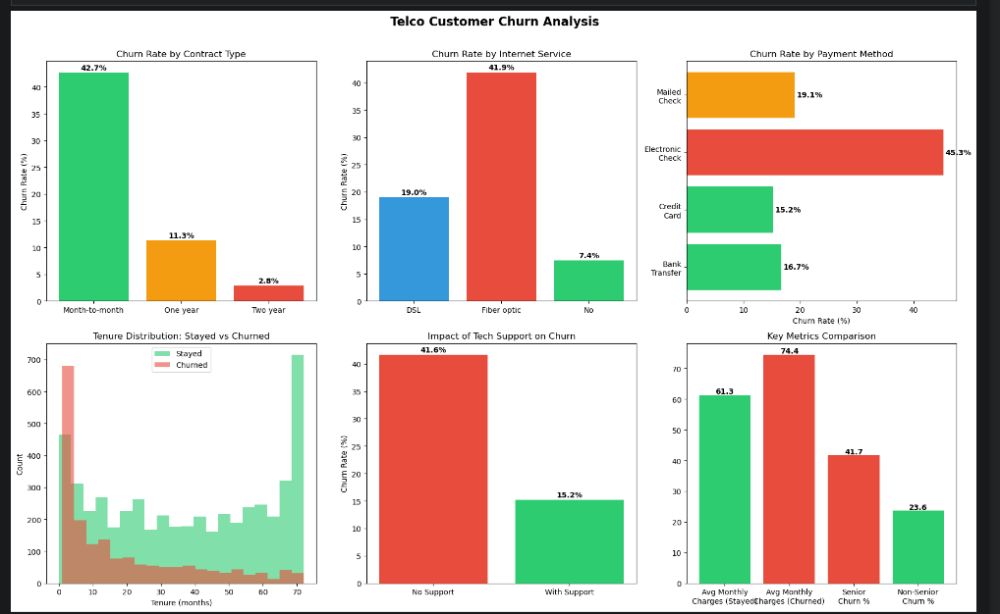

# Telco Customer Churn Analysis

Exploratory data analysis of 7,043 telecom customers to identify key drivers of churn (26.5% overall churn rate), built with Python and Pandas.

## Objective
Identify which customer segments are most likely to churn and provide actionable recommendations to improve retention.

## Key Insights
- **Contract type is the strongest predictor:** Month-to-month contracts churn at 42.7% vs only 2.8% for two-year contracts.
- **Electronic check payment method** has the highest churn rate at 45.3%.
- **Fiber optic customers** churn at 41.9% despite paying more — suggesting a quality or expectation mismatch.
- **Tech Support reduces churn significantly:** 41.6% without support vs 15.2% with support.
- **Churned customers leave early:** average tenure of 18 months vs 37.6 for retained customers.
- **Senior citizens** churn at 41.7% vs 23.6% for non-seniors.

## Business Recommendations
- Incentivize customers to switch from month-to-month to annual contracts.
- Offer Tech Support bundles to high-risk segments.
- Investigate Fiber optic service quality issues.
- Target senior citizens with dedicated retention programs.

## Tools & Skills
- Python, Pandas (data cleaning & analysis)
- Matplotlib (data visualization)
- Feature engineering, group analysis, churn rate calculation

## Process
1. **Data Import** — loaded 7,043 customer records across 21 columns.
2. **Data Cleaning** — converted TotalCharges to numeric, handled 11 missing values, added ChurnFlag column.
3. **Exploratory Analysis** — calculated churn rates by contract, internet service, payment method, tech support, and demographics.
4. **Visualization** — six-panel dashboard highlighting key churn drivers.

## Visualizations

## Files
- `churn_analysis.ipynb` — full analysis notebook
- `churn_analysis.png` — summary visualizations
