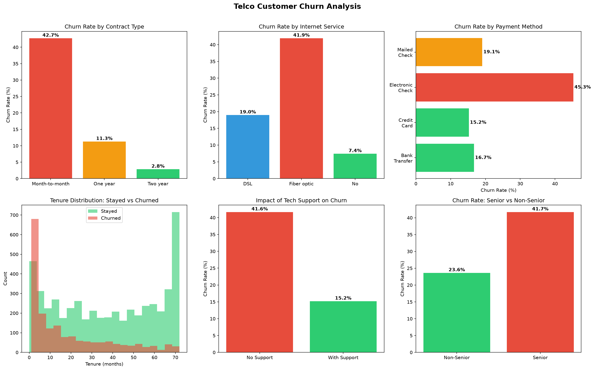

# 📡 Telco Customer Churn Analysis


Exploratory analysis of **7,043 telecom customers** to find out who churns and why — **26.5% overall churn rate** — ending with concrete retention recommendations.



## 🎯 Business Question
Which customer segments are most likely to leave, and what can the company do to keep them?

## 🔍 Key Insights
| Driver | Higher churn | Lower churn |
|--------|-------------|-------------|
| **Contract type** (strongest) | Month-to-month **42.7%** | Two-year **2.8%** |
| **Tech Support** | Without **41.6%** | With **15.2%** |
| **Internet service** | Fiber optic **41.9%** | — |
| **Payment method** | Electronic check **45.3%** | — |
| **Age group** | Seniors **41.7%** | Non-seniors **23.6%** |
| **Tenure** | Churned avg **18** months | Retained avg **37.6** months |

## 💡 Recommendations
1. **Move customers off month-to-month plans** with incentives for annual contracts.
2. **Bundle Tech Support** into plans for high-risk segments.
3. **Investigate Fiber optic service quality** — high-paying customers are leaving.
4. **Launch a senior retention program** with dedicated support.
5. **Focus on early tenure** — churned customers leave after 18 months on average.

## 🛠️ Process
1. **Import** — 7,043 records × 21 columns
2. **Cleaning** — converted `TotalCharges` to numeric, handled 11 missing values, added a binary churn flag
3. **Analysis** — churn rates by contract, service, payment method, support, and demographics
4. **Visualization** — six-panel dashboard of the main churn drivers

## 📁 Project Structure
```
├── data/
│   └── WA_Fn-UseC_-Telco-Customer-Churn.csv   # raw dataset
├── churn_analysis.ipynb                       # full analysis notebook
├── churn_analysis.png                         # dashboard
└── requirements.txt
```

## ▶️ How to Run
```bash
git clone https://github.com/iOsamah/telco-customer-churn-analysis.git
cd telco-customer-churn-analysis
pip install -r requirements.txt
jupyter notebook churn_analysis.ipynb
```

## 📊 Dataset
[IBM Telco Customer Churn](https://github.com/IBM/telco-customer-churn-on-icp4d) — sample dataset published by IBM (also on [Kaggle](https://www.kaggle.com/datasets/blastchar/telco-customer-churn)).

---

**Osama Dhifallah Hamdi** · [LinkedIn](https://linkedin.com/in/osama0hamdi) · [GitHub](https://github.com/iOsamah)
